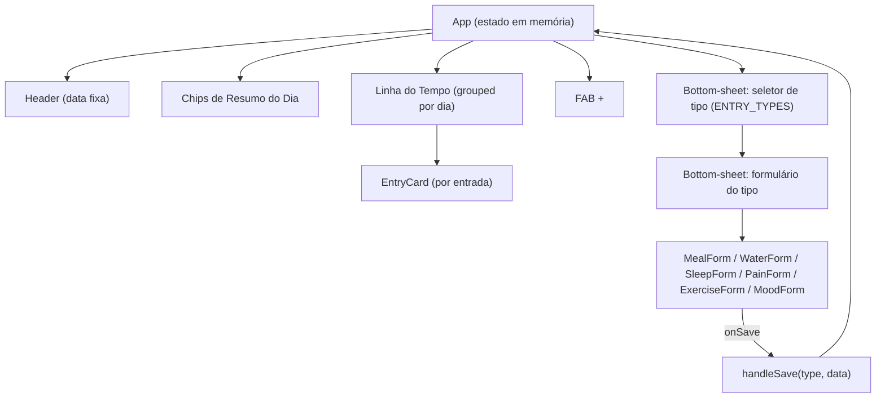
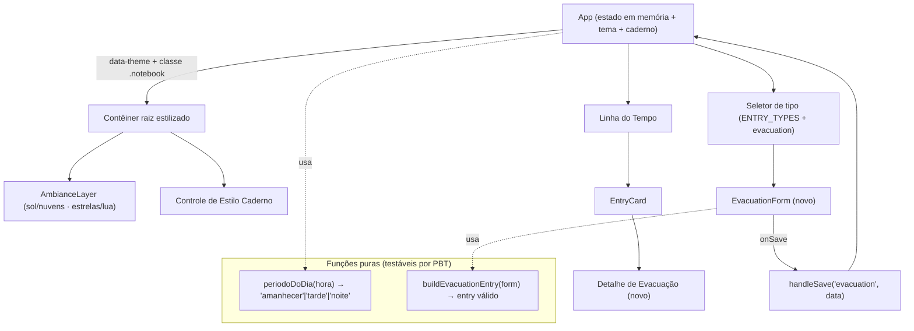

# Documento de Design

## Visão Geral

Este design cobre o **primeiro incremento** do protótipo *Diário Intestinal* (timelinegut) e implementa as três entregas mais o guarda-corpo regulatório definidos em `requirements.md`:

1. **Temas de ambiência por horário do dia** (Amanhecer 05–11h, Tarde 12–17h, Noite 18–04h, com Noite como *fallback*).
2. **Estilo caderno (manuscrito)** — alternância opcional, padrão desativado, estado em memória da sessão.
3. **Novo tipo de registro de Evacuação** — seguindo o padrão existente de `ENTRY_TYPES` + `Formulário_Bottom_Sheet`.
4. **Guarda-corpo regulatório** — rótulos da Escala de Bristol estritamente descritivos (apenas atributos observáveis), aplicado como princípio de conteúdo em toda a interface.

### Princípio orientador: extensão mínima, não nova arquitetura

O aplicativo atual é um **componente único** (`src/App.jsx`) com estado em memória via `useState`, estilizado com Tailwind 4 (classes utilitárias + cores terracota inline) e tipografia serifada (`font-serif`). Este incremento **estende esses padrões existentes** em vez de introduzir arquitetura pesada:

- **Sem backend, sem persistência, sem banco de dados.** Todo estado continua em memória, exatamente como hoje (`useState`/`useRef`).
- **Sem bibliotecas novas de estado.** Os temas e o estilo caderno são geridos por `useState` no componente raiz `App`, propagados por um atributo de dados (`data-theme`) e classes CSS — não por bibliotecas externas.
- **Sem fragmentação de arquivos.** A nova lógica (cálculo de tema, formulário de evacuação) é adicionada ao mesmo arquivo `App.jsx`, com pequenas funções puras auxiliares extraídas para facilitar o teste. As variáveis de tema e a fonte cursiva ficam em `src/index.css`.

### Resumo das decisões de design

| Tema de decisão | Escolha | Justificativa |
|---|---|---|
| Como aplicar o tema | Atributo `data-theme` no contêiner raiz + variáveis CSS | Sem re-render em cascata; troca de tema é uma única mutação de atributo; preserva Tailwind e cores inline existentes |
| Onde calcular o período | Função pura `periodoDoDia(hora)` + `useState` inicial em `App` | Função total testável por PBT; isolada de efeitos colaterais |
| Estilo caderno | Classe CSS `.notebook` no contêiner raiz + variável de fonte | Aplica fonte só aos textos dos registros sem mudar layout/cores |
| Fonte cursiva | `@font-face`/import com *stack* de *fallback* cursivo | Atende RF 2.7 (fallback legível) sem bloquear render |
| Evacuação | Nova chave em `ENTRY_TYPES` + novo `EvacuationForm` + `EvacuationDetail` no `EntryCard` | Reaproveita 100% do *pipeline* de pick → form → `handleSave` → timeline → chip |
| Bristol descritivo | Tabela de constantes `BRISTOL_DESCRICOES` com texto factual | Centraliza o guarda-corpo regulatório num único ponto de verdade |

---

## Arquitetura

### Estrutura atual (linha de base)



### Estrutura após o incremento

As adições estão destacadas; tudo o mais permanece idêntico.



### Camadas de responsabilidade

1. **Camada de tema (ambiência):** uma função pura determina o período a partir da hora local; o resultado vira o valor de `data-theme` no contêiner raiz. Variáveis CSS por tema definem cores de ambiência e elementos decorativos. Uma `AmbianceLayer` puramente decorativa é renderizada **atrás** do conteúdo (`z-index` negativo/inferior, `aria-hidden`).
2. **Camada de tipografia (caderno):** um booleano em memória alterna a classe `.notebook` no contêiner raiz; uma variável CSS `--fonte-registro` troca apenas a fonte dos textos dos registros.
3. **Camada de captura (evacuação):** reaproveita o *pipeline* `seletor → bottom-sheet → onSave → handleSave → entries`. Uma função pura monta a entrada normalizada a partir do estado do formulário.
4. **Camada de conteúdo (guarda-corpo):** constantes centralizadas garantem que todo texto descritivo, especialmente os rótulos de Bristol, contenha apenas atributos observáveis.

### Cálculo e aplicação do tema

O período é uma **função total da hora local inteira** (0–23):

```
periodoDoDia(hora):
  se hora não é inteiro em [0, 23]  → 'noite'      (fallback, RF 1.11)
  senão se 5  <= hora <= 11         → 'amanhecer'  (RF 1.3)
  senão se 12 <= hora <= 17         → 'tarde'      (RF 1.4)
  senão                             → 'noite'      (RF 1.5: 18–23 e 0–4)
```

Aplicação (no `App`):
- No primeiro render, `useState(() => periodoDoDia(horaLocalAtual()))` calcula o tema de abertura de forma síncrona — atende ao limite de 1 segundo (RF 1.2) sem *flash* nem bloqueio.
- `horaLocalAtual()` encapsula `new Date().getHours()` num `try/catch`; em erro/valor inválido retorna um sentinela que faz `periodoDoDia` cair no *fallback* Noite (RF 1.11).
- O valor é escrito como `data-theme="amanhecer|tarde|noite"` no `<div>` raiz. As cores de ambiência e a presença dos decorativos derivam desse atributo via CSS.

### Aplicação do estilo caderno

- Estado: `const [notebook, setNotebook] = useState(false)` no `App` (padrão desativado, RF 2.1; em memória, RF 2.8).
- O contêiner raiz recebe a classe `notebook` quando ativo.
- CSS: `.notebook` redefine `--fonte-registro` para a *stack* cursiva; os textos dos registros (`EntryCard` título/descrição/detalhes) usam `font-family: var(--fonte-registro)`. Layout, cores e espaçamento permanecem definidos pelas mesmas classes Tailwind (RF 2.5). A fonte cursiva é dimensionada para `font-size` ≥ tamanho padrão (RF 2.4).

---

## Componentes e Interfaces

### 1. Funções puras auxiliares (novas, em `App.jsx`)

```js
// Retorna o período de ambiência a partir de uma hora local inteira.
// Função TOTAL: qualquer entrada fora de [0,23] ou não-inteira → 'noite'.
function periodoDoDia(hora) // → 'amanhecer' | 'tarde' | 'noite'

// Obtém a hora local de forma defensiva; em falha retorna NaN (→ fallback Noite).
function horaLocalAtual() // → number (0–23) | NaN

// Normaliza o estado do formulário de evacuação em um objeto de entrada válido
// para a Linha do Tempo (aplica padrão Bristol=4 e mantém campos opcionais vazios).
function buildEvacuationEntry(form) // → { title, description, meta }
```

### 2. `AmbianceLayer` (novo componente decorativo)

- **Props:** `theme: 'amanhecer' | 'tarde' | 'noite'`.
- **Responsabilidade:** renderizar os elementos decorativos de fundo (sol + nuvens no Amanhecer; gradiente quente alaranjado na Tarde; estrelas + lua na Noite).
- **Posicionamento:** `position: absolute; inset: 0;` dentro do contêiner do app, **atrás** do conteúdo (camada inferior), com `aria-hidden="true"` e `pointer-events: none` para não interferir em toque/leitura.
- **Implementação:** SVG/markup leve condicionado ao `theme`; sem animações pesadas. Reusa a abordagem de SVG inline já presente no projeto (ver `PainCloud`).

### 3. `NotebookToggle` (novo controle — `Controle_de_Estilo_Caderno`)

- **Props:** `value: boolean`, `onChange: (boolean) => void`.
- **Responsabilidade:** alternar o `Estilo_Caderno`. Renderizado no cabeçalho (`<header>`), discreto, com rótulo textual factual (ex.: "Estilo caderno").
- **Acessibilidade:** botão com `aria-pressed={value}`.

### 4. `EvacuationForm` (novo formulário, padrão dos forms existentes)

Segue exatamente o padrão de `MealForm`/`SleepForm`: estado local com `useState`, blocos com rótulos `text-xs uppercase`, componentes `Chip` reutilizados, e um `SaveButton` ao final que chama `onSave(data)`.

- **Estado interno:**
  - `bristol` (número | null) — seleção de 1 a 7; `null` até o usuário escolher.
  - `cor` (string | null) — uma opção da lista predefinida ou nenhuma.
  - `odor` (string | null) — um nível da lista predefinida ou nenhum.
  - `esforco` (número | null) — 1 a 5 ou nenhum.
  - `tempo` (número | null) — minutos de 1 a 120 ou nenhum.
- **Interações (limites garantidos pela UI):**
  - Bristol: grade/escala de 7 botões mutuamente exclusivos (RF 3.3), cada um com rótulo **descritivo** vindo de `BRISTOL_DESCRICOES` (RF 4.2).
  - Cor: `Chip`s de seleção única a partir de `EVAC_CORES` (RF 3.4).
  - Odor: `Chip`s de seleção única a partir de `EVAC_ODORES` (RF 3.5).
  - Esforço: 5 botões mutuamente exclusivos (RF 3.6).
  - Tempo: controle numérico/stepper limitado a 1–120 (RF 3.7).
- **Salvar:** chama `onSave(buildEvacuationEntry(estado))`. `buildEvacuationEntry` aplica Bristol=4 quando `bristol` é `null` (RF 3.11) e preserva os demais campos vazios sem bloquear (RF 3.12).

### 5. Integração no `App` (alterações pontuais)

- **`ENTRY_TYPES`:** adicionar a chave `evacuation` com `label`, `icon` (ex.: `Sprout`/`Leaf` do lucide-react — neutro), `color` e `soft` próprios, distintos dos tipos existentes (RF 3.1, 3.9).
- **Seletor de tipo (bottom-sheet):** já itera sobre `Object.entries(ENTRY_TYPES)`, logo o novo tipo aparece automaticamente no seletor (RF 3.1).
- **Despacho do formulário:** adicionar a linha `{activeForm === 'evacuation' && <EvacuationForm onSave={(d) => handleSave('evacuation', d)} />}` no bloco de detalhe.
- **Chips de resumo do dia:** já iteram sobre `ENTRY_TYPES`, então o chip de evacuação aparece com a contagem assim que houver ao menos um registro (RF 3.10).
- **`EntryCard`:** adicionar um ramo de renderização para `entry.type === 'evacuation'` exibindo um resumo factual (descrição Bristol + atributos preenchidos). Reusa o cabeçalho ícone/título/horário comum a todos os tipos (RF 3.9).
- **Contêiner raiz:** aplicar `data-theme={tema}` e `className={... ${notebook ? 'notebook' : ''}}`; renderizar `<AmbianceLayer theme={tema} />` como primeira filha (camada de fundo) e `<NotebookToggle .../>` no header.

### 6. Estilos (`src/index.css`)

- Definir variáveis por tema sob seletores de atributo, preservando a `Identidade_Visual_Base` (terracota + serifada) em todos:

```css
:root { --fonte-registro: inherit; }                 /* tipografia padrão */
[data-theme="amanhecer"] { --amb-bg-1: …; --amb-bg-2: …; --amb-text: #2B2A28; }
[data-theme="tarde"]     { --amb-bg-1: …; --amb-bg-2: …; --amb-text: #2B2A28; }
[data-theme="noite"]     { --amb-bg-1: …; --amb-bg-2: …; --amb-text: #F2ECE3; }

.notebook { --fonte-registro: "Caveat", "Segoe Print", "Bradley Hand", cursive; }
.entry-text { font-family: var(--fonte-registro); }
```

- A fonte cursiva é declarada com *stack* de *fallback* cursivo do sistema; se a fonte principal (`Caveat`, via import/`@font-face`) não carregar, o navegador usa o próximo cursivo legível e o controle permanece ativo (RF 2.7). O tamanho da fonte cursiva é igual ou maior que o padrão (RF 2.4).
- As cores de texto por tema garantem contraste ≥ 4,5:1 contra a ambiência de fundo (RF 1.10).

---

## Modelos de Dados

### Constantes de tipo (extensão de `ENTRY_TYPES`)

```js
const ENTRY_TYPES = {
  // ...tipos existentes...
  evacuation: { label: 'Evacuação', icon: <ícone neutro>, color: '#8A6D3B', soft: '#EFE7D6' },
};
```

> Cores ilustrativas (tom terroso, coerente com a paleta terracota); o valor exato é decidido na implementação desde que distinto dos demais e com contraste adequado.

### Escala de Bristol — rótulos descritivos (guarda-corpo, RF 4.2)

Tabela única e centralizada com **apenas atributos observáveis** (forma, consistência, textura), **sem** nomes de condições, diagnóstico, juízo de normalidade ou recomendação:

```js
const BRISTOL_DESCRICOES = {
  1: 'Pedaços duros e separados, como pequenas bolinhas',
  2: 'Formato alongado, com superfície grumosa',
  3: 'Formato alongado, com rachaduras na superfície',
  4: 'Formato alongado, superfície lisa e macia',
  5: 'Pedaços macios com bordas bem definidas',
  6: 'Pedaços moles com bordas irregulares',
  7: 'Totalmente líquido, sem pedaços sólidos',
};
```

### Listas predefinidas de cor e odor (descritivas)

```js
const EVAC_CORES   = ['Marrom claro', 'Marrom', 'Marrom escuro', 'Amarelada', 'Esverdeada', 'Avermelhada', 'Escura'];
const EVAC_ODORES  = ['Leve', 'Moderado', 'Forte'];
```

> Termos puramente observáveis (RF 4.1–4.4): descrevem o que é visto/percebido, sem interpretação de saúde.

### Forma de dados da entrada de Evacuação

Coerente com o formato de entrada existente (`{ id, day, time, type, title, description, meta? }`). A entrada de evacuação acrescenta um `meta` estruturado:

```js
{
  id: <número>,            // atribuído por handleSave (idRef)
  day: 'hoje',             // atribuído por handleSave
  time: 'HH:MM',           // horário local do salvamento (RF 3.8)
  type: 'evacuation',
  title: 'Evacuação',
  description: <string>,   // resumo factual derivado dos campos preenchidos
  meta: {
    bristol: <inteiro 1–7>,        // obrigatório no objeto; default 4 se não selecionado (RF 3.11)
    cor:     <string | null>,      // null se não preenchido (RF 3.12)
    odor:    <string | null>,      // null se não preenchido (RF 3.12)
    esforco: <inteiro 1–5 | null>, // null se não preenchido (RF 3.12)
    tempo:   <inteiro 1–120 | null>// minutos; null se não preenchido (RF 3.12)
  }
}
```

### Invariantes do modelo (válidas para toda entrada de evacuação salva)

- `type === 'evacuation'` e `title` não vazio.
- `meta.bristol` é inteiro e `1 ≤ meta.bristol ≤ 7`.
- `meta.cor ∈ EVAC_CORES ∪ {null}`; `meta.odor ∈ EVAC_ODORES ∪ {null}`.
- `meta.esforco ∈ {1..5} ∪ {null}`; `meta.tempo ∈ {1..120} ∪ {null}`.
- `time` no formato `HH:MM` (24h, zero-padded) e `day === 'hoje'`.
- `description` contém apenas texto factual derivado dos campos (sem interpretação).

### Modelo de estado da aplicação (em memória)

```js
entries  : Array<Entry>      // existente
sheetOpen: boolean           // existente
activeForm: string | null    // existente
tema     : 'amanhecer' | 'tarde' | 'noite'   // novo — derivado de periodoDoDia
notebook : boolean           // novo — padrão false, sessão em memória
```


---

## Propriedades de Correção

*Uma propriedade é uma característica ou comportamento que deve permanecer verdadeiro em todas as execuções válidas de um sistema — essencialmente, uma afirmação formal sobre o que o sistema deve fazer. As propriedades servem de ponte entre as especificações legíveis por humanos e as garantias de correção verificáveis por máquina.*

As propriedades abaixo derivam da análise de *prework* dos critérios de aceitação. Critérios puramente visuais (renderização de decorativos, preservação de layout/cores, tempos de 1 segundo) são cobertos por testes de exemplo/snapshot na Estratégia de Testes e não geram propriedades universais. As propriedades redundantes foram consolidadas conforme a reflexão de propriedades.

### Propriedade 1: Seleção de tema é uma função total e correta da hora local

*Para toda* hora local — válida (inteiro em [0,23]) ou inválida (NaN, negativa, maior que 23, fracionária ou não numérica) — a função `periodoDoDia` retorna exatamente um dos valores `'amanhecer'`, `'tarde'` ou `'noite'`, de modo que: horas em [5,11] → `'amanhecer'`; horas em [12,17] → `'tarde'`; horas em [18,23] ∪ [0,4] → `'noite'`; e toda entrada inválida → `'noite'` (fallback).

**Validates: Requirements 1.1, 1.3, 1.4, 1.5, 1.11**

### Propriedade 2: O salvamento de evacuação sempre produz uma entrada de timeline válida

*Para todo* estado possível do formulário de evacuação, `buildEvacuationEntry` (seguido de `handleSave`) produz uma entrada com `type === 'evacuation'`, `title` não vazio, `day === 'hoje'`, `time` no formato `HH:MM` de 24 horas, `meta.bristol` inteiro em [1,7] (igual a 4 quando nenhum valor foi selecionado), `meta.cor ∈ EVAC_CORES ∪ {null}`, `meta.odor ∈ EVAC_ODORES ∪ {null}`, `meta.esforco ∈ {1..5} ∪ {null}` e `meta.tempo ∈ {1..120} ∪ {null}`; e o salvamento nunca é impedido por campos opcionais ausentes.

**Validates: Requirements 3.3, 3.4, 3.5, 3.6, 3.7, 3.8, 3.11, 3.12**

### Propriedade 3: O chip de resumo do dia reflete a contagem exata de evacuações

*Para toda* lista de entradas, o Chip_de_Resumo_do_Dia de Evacuação é exibido se e somente se existe ao menos um Registro_de_Evacuação no dia atual, e a contagem exibida é exatamente igual ao número de registros de evacuação do dia atual.

**Validates: Requirements 3.10**

### Propriedade 4: A alternância do estilo caderno é reversível (round-trip)

*Para todo* estado do Controle_de_Estilo_Caderno, alterná-lo duas vezes retorna ao estado original, e desativá-lo restaura a tipografia padrão dos textos dos registros, enquanto layout, cores e espaçamento permanecem inalterados.

**Validates: Requirements 2.3, 2.5**

### Propriedade 5: Sob o estilo caderno, todo texto de registro herda a fonte manuscrita

*Para toda* lista de registros renderizada com o Estilo_Caderno ativo, todos os textos dos registros — independentemente de terem sido adicionados antes ou depois da ativação — usam a fonte cursiva/manuscrita (via `--fonte-registro`), com tamanho de fonte igual ou superior ao padrão.

**Validates: Requirements 2.4, 2.6**

### Propriedade 6: Todo texto descritivo controlado é factual e livre de termos proibidos

*Para todo* rótulo nos conjuntos de conteúdo controlados (`BRISTOL_DESCRICOES` para valores 1–7, `EVAC_CORES`, `EVAC_ODORES`), o texto é não vazio, descreve apenas atributos observáveis e não contém nenhum termo de uma lista proibida de diagnóstico, nome de condição/doença, afirmação de causalidade, juízo de normalidade/anormalidade ou recomendação de tratamento; adicionalmente, `BRISTOL_DESCRICOES` define um texto factual para cada valor inteiro de 1 a 7.

**Validates: Requirements 4.1, 4.2, 4.3, 4.4**

---

## Tratamento de Erros

| Cenário | Estratégia | Requisito |
|---|---|---|
| Hora local indisponível ou inválida | `horaLocalAtual()` encapsula o acesso ao relógio em `try/catch`; em falha retorna `NaN`, e `periodoDoDia(NaN)` retorna `'noite'`. O cálculo é síncrono e nunca lança, então o carregamento do app não é bloqueado. | RF 1.11 |
| Fonte cursiva não carrega | A *stack* CSS termina em `cursive`, garantindo um fallback legível do sistema. O estado do toggle (`notebook`) é independente do carregamento da fonte e permanece ativo. | RF 2.7 |
| Bristol não selecionado ao salvar | `buildEvacuationEntry` aplica o `Valor_Padrão_Bristol` (4) quando `bristol` é `null`. O salvamento prossegue normalmente. | RF 3.11 |
| Campos opcionais (cor/odor/esforço/tempo) não preenchidos | `buildEvacuationEntry` normaliza ausências para `null` e nunca bloqueia a confirmação. A `description` é montada apenas com os campos presentes. | RF 3.12 |
| Entrada fora de faixa via UI | A UI restringe as seleções aos domínios válidos por construção (botões/steppers limitados); `buildEvacuationEntry` também faz *clamp*/validação defensiva como segunda barreira antes de criar a entrada. | RF 3.3, 3.6, 3.7 |
| Contraste insuficiente em algum tema | As cores de texto por tema são fixas e escolhidas para atender ≥ 4,5:1; um teste automatizado verifica a razão de contraste de cada tema. | RF 1.10 |

Nenhum tratamento de erro envolve rede, persistência ou backend — coerente com o escopo em memória deste incremento.

---

## Estratégia de Testes

### Abordagem dupla

- **Testes de propriedade (PBT):** verificam as propriedades universais 1–6 sobre muitas entradas geradas.
- **Testes de exemplo/snapshot:** cobrem comportamento visual e de configuração que não é uma propriedade universal (renderização de decorativos por tema, presença do tipo no seletor, preservação de layout, contraste finito por tema, estados iniciais).

### Aplicabilidade do PBT

PBT **é apropriado** para este incremento porque há lógica pura com domínios de entrada amplos:
- `periodoDoDia(hora)` — função total testável sobre todas as horas e entradas inválidas.
- `buildEvacuationEntry(form)` — transformação de dados com invariantes claras.
- Contagem de chip e invariantes de tipografia — funções determinísticas sobre listas geradas de registros.

PBT **não é apropriado** para: renderização de elementos decorativos de ambiência, preservação de identidade visual, e o requisito de tempo "≤ 1 segundo" — estes usam testes de exemplo/snapshot.

### Biblioteca e configuração

- **Biblioteca de PBT:** `fast-check` (padrão para o ecossistema JS/React; não implementar PBT do zero).
- **Runner de testes:** `vitest` com `@testing-library/react` para os testes de componente/render. Executar em modo único (`vitest --run`), não em modo *watch*.
- **Iterações:** cada teste de propriedade executa no mínimo **100 iterações** (configuração `fast-check` `numRuns: 100`).
- **Etiqueta obrigatória:** cada teste de propriedade referencia a propriedade do design no formato:
  `// Feature: temas-e-registro-evacuacao, Property {número}: {texto da propriedade}`
- Cada propriedade de correção é implementada por **um único** teste de propriedade.

### Mapeamento de testes

| Propriedade | Geradores | Foco da verificação |
|---|---|---|
| P1 — Tema total | inteiros [0,23], inteiros fora da faixa, NaN, frações, não-números | resultado sempre ∈ {amanhecer,tarde,noite} e correto por faixa; inválidos → noite |
| P2 — Entrada válida | estado de formulário arbitrário (bristol null ou 1–7; cor/odor válidos ou null; esforço/tempo na faixa ou null) | invariantes da entrada; default Bristol=4; campos opcionais → null; nunca bloqueia |
| P3 — Chip | listas arbitrárias de entradas de tipos variados | chip aparece sse ≥1 evacuação hoje; contagem exata |
| P4 — Round-trip caderno | estado booleano inicial arbitrário | toggle∘toggle = identidade; desativar restaura fonte padrão |
| P5 — Herança tipográfica | listas arbitrárias de registros | sob `.notebook`, todo texto usa `--fonte-registro`; tamanho ≥ padrão |
| P6 — Conteúdo factual | índices de Bristol 1–7 e itens de EVAC_CORES/EVAC_ODORES | não vazio; sem termos proibidos; Bristol cobre 1–7 |

### Testes de exemplo / snapshot (complementares)

- Render de cada tema (`data-theme`) exibindo os decorativos esperados — sol/nuvens, quente alaranjado, estrelas/lua (RF 1.6–1.8).
- Preservação da tipografia serifada e do token terracota em cada tema (RF 1.9).
- Razão de contraste ≥ 4,5:1 calculada para os 3 temas (RF 1.10).
- Estado inicial: `notebook === false` e tipografia padrão (RF 2.1).
- Ativar caderno aplica `.notebook`; tamanho de fonte ≥ padrão (RF 2.2, 2.4).
- Snapshot confirmando que layout/cores/espaçamento não mudam entre com/sem caderno (RF 2.5).
- *Stack* de fonte termina em `cursive` (RF 2.7).
- Estado do toggle mantido em memória entre re-renders, sem gravação em storage (RF 2.8).
- Seletor de tipo contém "Evacuação" (RF 3.1) e o form segue o padrão bottom-sheet (RF 3.2).
- `EntryCard` de evacuação usa ícone/cores próprios de `ENTRY_TYPES.evacuation` (RF 3.9).

### Equilíbrio de testes unitários

Os testes de exemplo focam em casos concretos e pontos de integração (render por tema, presença no seletor, estado inicial). A cobertura ampla de entradas fica a cargo dos testes de propriedade, evitando excesso de testes unitários redundantes.

---

## Rastreabilidade de Requisitos

| Requisito | Onde é endereçado no design |
|---|---|
| RF 1.1–1.5, 1.11 | `periodoDoDia` / `horaLocalAtual` (Arquitetura · Funções puras); Propriedade 1 |
| RF 1.2 | Cálculo síncrono no primeiro render (`useState` inicial) |
| RF 1.6–1.8 | `AmbianceLayer` + variáveis de tema por `data-theme` |
| RF 1.9 | Identidade_Visual_Base preservada (terracota + serifada em todos os temas) |
| RF 1.10 | Cores de texto por tema; verificação de contraste |
| RF 2.1–2.8 | `NotebookToggle` + classe `.notebook` + `--fonte-registro`; Propriedades 4 e 5 |
| RF 3.1, 3.2, 3.9, 3.10 | Extensão de `ENTRY_TYPES`, `EvacuationForm`, `EntryCard`, chips; Propriedade 3 |
| RF 3.3–3.8, 3.11, 3.12 | `EvacuationForm` + `buildEvacuationEntry` + `handleSave`; Propriedade 2 |
| RF 4.1–4.4 | `BRISTOL_DESCRICOES`, `EVAC_CORES`, `EVAC_ODORES` (conteúdo factual centralizado); Propriedade 6 |
